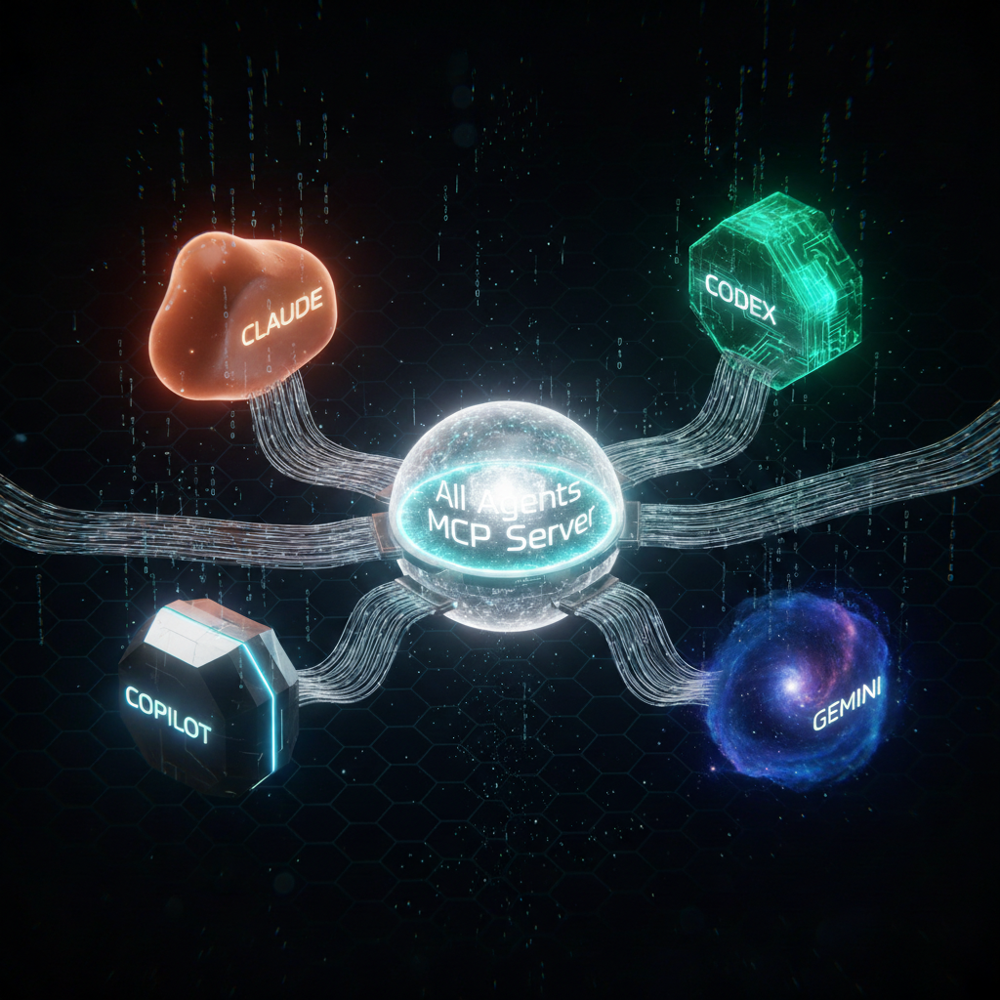

<p align="center">
  
</p>

# All-Agents-MCP

An MCP server that orchestrates multiple AI CLI agents — Claude Code, Codex, Gemini CLI, and Copilot CLI — through a unified interface. Delegate tasks, run cross-agent comparisons, and leverage each agent's strengths from any MCP-compatible host.

## Why MCP?

Multi-agent orchestration can also be achieved by configuring CLI integrations directly in `~/.claude/CLAUDE.md`. For example, you can add Codex integration like this:

```markdown
## Codex CLI Integration
When the user asks to "consult with Codex" or similar:
1. Store the requirement in the $PROMPT environment variable
2. Run `codex --model gpt-5.3-codex-spark xhigh exec "$PROMPT"`
3. Show the Codex response and add your own commentary
4. Compare results and select the optimal solution
```

Similar patterns can be applied for Gemini CLI, Copilot CLI, and others. This works well for individual use.

However, this project was intentionally built as a standalone **MCP server** for the following reason:

In **enterprise environments**, teams often share a common `CLAUDE.md` managed at the organization or repository level. Embedding agent orchestration logic into `CLAUDE.md` would conflict with or pollute these shared configurations. By encapsulating the orchestration as an **MCP server**, the multi-agent capability becomes a modular, pluggable extension — completely independent of any existing `CLAUDE.md` setup. This allows teams to adopt cross-agent workflows without modifying their shared development guidelines.

## Safe by Design — No OAuth Token Hijacking

Some multi-agent tools work by extracting OAuth tokens from other AI services and calling their APIs directly. This approach (used by projects like [OpenCode](https://github.com/nicepkg/OpenCode)) violates the terms of service of those platforms and can result in **account suspension or permanent bans**.

**all-agents-mcp takes a fundamentally different approach.** It invokes each agent's **official CLI binary** (`claude`, `codex`, `gemini`, `copilot`) as a child process — exactly the same way a human would use them in a terminal. No tokens are extracted, no APIs are called behind the scenes, and no authentication is bypassed.

| | all-agents-mcp | OAuth token hijacking |
|---|---|---|
| **How it works** | Calls official CLI commands directly | Extracts tokens from browser/config and calls APIs |
| **Authentication** | Uses each CLI's own auth flow | Steals OAuth tokens from other services |
| **ToS compliance** | Fully compliant | Violates platform terms of service |
| **Account risk** | None | Suspension or permanent ban |
| **Billing** | Normal CLI usage billing | Unpredictable — may trigger abuse detection |

> Each CLI agent manages its own authentication, billing, and rate limits. all-agents-mcp is simply a process orchestrator — it doesn't touch your credentials.

## Features

- **Single-agent queries** — Ask a specific agent with `ask_agent`
- **Multi-agent comparison** — Run the same prompt across all agents in parallel with `ask_all`
- **Task delegation** — Auto-analyze complexity and route to one or multiple agents
- **Cross-model verification** — Verify answers by running one agent with different models
- **Specialized tools** — Code review, debugging, explanation, test generation, refactoring
- **Recursive call prevention** — Automatically excludes the calling agent to avoid infinite loops
- **Session history** — All interactions are recorded and queryable via MCP resources
- **Environment-based model config** — Override models at runtime via `AA_MCP_*` environment variables

## Prerequisites

- **Node.js 22+**
- At least one of the following CLI agents installed and authenticated:

| Agent | Install | Auth |
|-------|---------|------|
| [Claude Code](https://docs.anthropic.com/en/docs/claude-code) | `npm i -g @anthropic-ai/claude-code` | `claude` (follow prompts) |
| [Codex](https://github.com/openai/codex) | `npm i -g @openai/codex` | `codex login` |
| [Gemini CLI](https://github.com/google-gemini/gemini-cli) | `npm i -g @anthropic-ai/gemini-cli` | `gemini` (follow prompts) |
| [Copilot CLI](https://githubnext.com/projects/copilot-cli) | `npm i -g @githubnext/github-copilot-cli` | `copilot` (follow prompts) |

## Installation

### Claude Code

#### As a Plugin (recommended)

```bash
# 1. Add marketplace (includes all Dokkabei97 plugins)
/plugin marketplace add Dokkabei97/claude-plugins

# 2. Install plugin
/plugin install all-agents-mcp
```

> You can also add the plugin repository directly: `/plugin marketplace add Dokkabei97/all-agents-mcp`

This installs all-agents-mcp as a Claude Code plugin, giving you:
- 6 skills (`/all-agents-mcp:ask`, `/all-agents-mcp:ask-all`, `/all-agents-mcp:delegate`, `/all-agents-mcp:review`, `/all-agents-mcp:debug`, `/all-agents-mcp:agents`)
- 2 commands (`/all-agents-mcp:status`, `/all-agents-mcp:models`)
- Automatic MCP server connection via `npx`
- Session start health checks

#### As MCP Server

```bash
claude mcp add all-agents-mcp -- npx -y all-agents-mcp
```

Or manually add to `~/.claude.json`:

```json
{
  "mcpServers": {
    "all-agents-mcp": {
      "command": "npx",
      "args": ["-y", "all-agents-mcp"]
    }
  }
}
```

### Codex CLI

```bash
codex mcp add all-agents-mcp -- npx -y all-agents-mcp
```

Or manually add to `~/.codex/config.toml`:

```toml
[mcp_servers.all-agents-mcp]
command = "npx"
args = ["-y", "all-agents-mcp"]

[mcp_servers.all-agents-mcp.env]
AA_MCP_LOG_LEVEL = "warn"
```

### Gemini CLI

```bash
gemini mcp add all-agents-mcp npx -y all-agents-mcp
```

Or manually add to `~/.gemini/settings.json`:

```json
{
  "mcpServers": {
    "all-agents-mcp": {
      "command": "npx",
      "args": ["-y", "all-agents-mcp"]
    }
  }
}
```

### Copilot CLI

Add to `~/.copilot/mcp-config.json`:

```json
{
  "servers": [
    {
      "name": "all-agents-mcp",
      "type": "stdio",
      "command": "npx",
      "args": ["-y", "all-agents-mcp"]
    }
  ]
}
```

### From Source

```bash
git clone https://github.com/Dokkabei97/all-agents-mcp.git
cd all-agents-mcp
npm install
npm run build

# Claude Code
claude mcp add all-agents-mcp -- node /path/to/all-agents-mcp/dist/index.js

# Codex
codex mcp add all-agents-mcp -- node /path/to/all-agents-mcp/dist/index.js

# Gemini CLI
gemini mcp add all-agents-mcp node /path/to/all-agents-mcp/dist/index.js
```

## Plugin Skills & Commands

When installed as a Claude Code plugin, the following skills and commands are available:

### Skills

| Skill | Usage | Description |
|-------|-------|-------------|
| `ask` | `/all-agents-mcp:ask codex <question>` | Ask a specific agent a question |
| `ask-all` | `/all-agents-mcp:ask-all <question>` | Ask all agents in parallel and compare |
| `delegate` | `/all-agents-mcp:delegate <task>` | Auto-analyze complexity and route to agent(s) |
| `review` | `/all-agents-mcp:review codex [focus]` | Code review by an external agent |
| `debug` | `/all-agents-mcp:debug gemini <error>` | Debug an error with an external agent |
| `agents` | `/all-agents-mcp:agents` | Show all agents status and health |

### Commands

| Command | Usage | Description |
|---------|-------|-------------|
| `status` | `/all-agents-mcp:status` | Quick health check of all agents |
| `models` | `/all-agents-mcp:models` | List available models for all agents |

## Tools (13)

### Core Tools

| Tool | Description |
|------|-------------|
| `ask_agent` | Ask a specific agent a question. Specify which agent and optionally which model. |
| `ask_all` | Ask all available agents the same question in parallel. Returns a comparison. |
| `delegate_task` | Delegate a task with automatic complexity analysis. Simple tasks go to one agent; large tasks are split across multiple agents. |
| `collaborate` | Collaborate with an agent — get its response alongside guidance for synthesizing both perspectives. |

### Verification

| Tool | Description |
|------|-------------|
| `verify` | Cross-verify by running the same prompt across multiple models of one agent (e.g., Copilot with GPT, Claude, and Gemini models). |

### Specialized Tools

| Tool | Description |
|------|-------------|
| `review_code` | Code review with focus options: `bugs`, `security`, `performance`, `clarity`. |
| `debug_with` | Debug an error — provide the error message and optional code context. |
| `explain_with` | Get code explanation at `brief` or `detailed` level. |
| `generate_test` | Generate tests with optional framework selection (`jest`, `vitest`, `pytest`, `kotest`). |
| `refactor_with` | Refactor code with a goal: `performance`, `readability`, or `modularity`. |

### Info Tools

| Tool | Description |
|------|-------------|
| `list_agents` | List all detected agents and their availability status. |
| `list_models` | List available models per agent. |
| `agent_health` | Health check — availability, authentication status, latency. |

## Resources (3)

| URI | Description |
|-----|-------------|
| `aa://sessions` | List of all recorded sessions |
| `aa://session/{id}/history` | Full interaction history for a session |
| `aa://agents/status` | Current status of all agents |

## Usage Examples

Once registered, use natural language in Claude Code:

```
# Ask a specific agent
"Ask Codex to implement a binary search function"

# Compare across agents
"Ask all agents how to optimize this SQL query"

# Delegate a task
"Delegate writing unit tests for src/utils/ to Gemini"

# Collaborate
"Collaborate with Copilot to review this architecture"

# Cross-model verification
"Verify with Copilot using gpt-5.2-codex, claude-sonnet-4.5, and gemini-3-pro-preview"

# Code review
"Ask Codex to review this code for security vulnerabilities"

# Debug
"Debug this TypeError with Gemini"

# Generate tests
"Generate vitest tests for this function using Codex"

# Check status
"Show me all available agents and their health"
```

## Model Configuration

Models are configured via environment variables with the `AA_MCP_` prefix. Set them in your MCP client config to override defaults at runtime:

```json
{
  "mcpServers": {
    "all-agents-mcp": {
      "command": "npx",
      "args": ["-y", "all-agents-mcp"],
      "env": {
        "AA_MCP_CLAUDE_DEFAULT": "claude-sonnet-4.5",
        "AA_MCP_CODEX_ANALYSIS_LEVEL": "medium",
        "AA_MCP_GEMINI_MODELS": "gemini-2.5-pro,gemini-2.5-flash"
      }
    }
  }
}
```

### Available Environment Variables

| Variable | Default | Description |
|----------|---------|-------------|
| `AA_MCP_CLAUDE_DEFAULT` | `claude-opus-4.6` | Claude default model |
| `AA_MCP_CLAUDE_MODELS` | `claude-opus-4.6,claude-sonnet-4.5,claude-haiku-4.5` | Available Claude models (comma-separated) |
| `AA_MCP_CODEX_DEFAULT` | `gpt-5.3-codex-spark` | Codex default model |
| `AA_MCP_CODEX_MODELS` | `gpt-5.3-codex-spark,gpt-5.3-codex,gpt-5.2-codex-max,gpt-5.2-codex` | Available Codex models |
| `AA_MCP_CODEX_ANALYSIS_LEVEL` | `xhigh` | Codex reasoning depth (`low`/`medium`/`high`/`xhigh`) |
| `AA_MCP_GEMINI_DEFAULT` | `gemini-3-pro-preview` | Gemini default model |
| `AA_MCP_GEMINI_MODELS` | `gemini-3-pro-preview,gemini-3-flash-preview,gemini-2.5-pro,gemini-2.5-flash` | Available Gemini models |
| `AA_MCP_COPILOT_DEFAULT` | `claude-sonnet-4.5` | Copilot default model |
| `AA_MCP_COPILOT_MODELS` | `claude-opus-4.5,claude-sonnet-4.5,claude-haiku-4.5,gpt-5.2-codex,gemini-3-pro-preview,gemini-3-flash-preview` | Available Copilot models |

## Recursive Call Prevention

When all-agents-mcp runs inside an agent (e.g., Claude Code calls all-agents-mcp), it automatically detects the caller and excludes it from the available agent list. This prevents infinite recursive loops.

Detection methods (in priority order):
1. CLI argument: `--caller=claude`
2. Environment variables: `CLAUDECODE`, `CODEX_SANDBOX_TYPE`, `GEMINI_CLI`, `COPILOT_CLI`
3. `process.env._` fallback

## Development Methodology

This project is built following [AIDE (Agent-Informed Development Engineering) v1.0](./AIDE-REFERENCE.md) — a software development methodology designed for the agentic era. Key principles applied include context budget constraints, locality of behavior, functional core architecture, test-as-specification, and deterministic guardrails.

## Test Status

All agents have been tested and verified **except Copilot CLI**, which is pending integration testing.

| Agent | Status |
|-------|--------|
| Claude Code | Tested |
| Codex | Tested |
| Gemini CLI | Tested |
| Copilot CLI | Not yet tested |

## Architecture

```
all-agents-mcp/
├── src/
│   ├── agents/          # Agent abstraction layer
│   │   ├── types.ts     #   IAgent interface, AgentResponse, HealthStatus
│   │   ├── base-agent.ts#   Abstract base with spawn logic
│   │   ├── claude-agent.ts
│   │   ├── codex-agent.ts
│   │   ├── gemini-agent.ts
│   │   ├── copilot-agent.ts
│   │   └── registry.ts  #   Detection, registration, recursion guard
│   │
│   ├── tools/           # 13 MCP tool definitions
│   ├── orchestrator/    # Parallel execution, complexity analysis, verification
│   ├── session/         # File-based session storage
│   ├── resources/       # 3 MCP resource definitions
│   ├── config/          # Env var config loader (AA_MCP_* overrides) + Zod schema
│   ├── utils/           # Logger (stderr), CLI detection
│   ├── server.ts        # McpServer factory
│   └── index.ts         # Entry point (stdio transport)
```

## Development

```bash
npm install          # Install dependencies
npm run build        # Compile TypeScript
npm run dev          # Watch mode
npm run lint         # Biome lint + format
npm test             # Run tests
```

### Debug logging

```bash
AA_MCP_LOG_LEVEL=debug node dist/index.js
```

Log levels: `debug`, `info` (default), `warn`, `error`. All logs go to stderr to avoid interfering with MCP stdio transport.

## License

MIT
